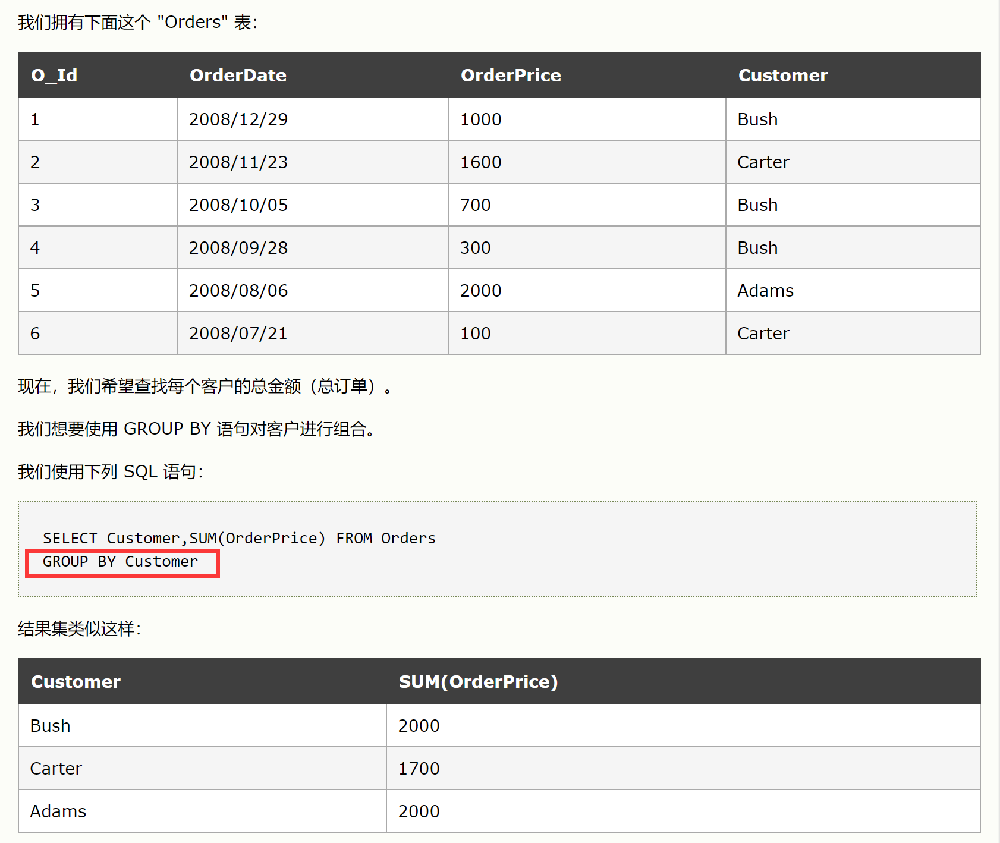

# MySQL

[数据库系统原理](数据库系统原理/数据库系统原理.md)

[MySQL练习题](MySQL练习题/MySQL练习题.md)

# 面试重点

## 数据库三大范式

第一范式：每个列都不可以再拆分。
第二范式：在第一范式的基础上，非主属性完全依赖于主键。
第三范式：在第二范式的基础上，非主属性只依赖于主键，不存在传递依赖。

## 关系型数据库和非关系型数据库的区别？

关系型数据库最典型的数据结构是表，由二维表及其之间的联系所组成的一个数据组织。

非关系型数据库是一种数据结构化存储方法的集合，可以是文档或者键值对等。

## char和varchar的区别

1. char是固定长度，varchar长度可变。varchar：**如果原先存储的位置无法满足其存储的需求**，就需要一些额外的操作，根据存储引擎的不同，有的会采用**拆分机制**，有的采用**分页机制**。

2. char和varchar的存储字节由**具体的字符集**来决定;

3. char是固定长度，长度不够的情况下，用空格代替。varchar表示的是实际长度的数据类型

## 内连接、左外连接和右外连接？

- 内连接 查询左右表同时满足条件的记录，两边都不可为 null。

- 左外连接 以左表为主表，可以查询左表存在而右表为 null 的记录。

- 右外连接 以右表为主表，可以查询右表存在而左表为 null 的记录。

## where和having的区别

- where是一个约束声明，在查询前进行约束

- having是一个过滤声明，对查询数据进行过滤

[https://blog.csdn.net/liuweiyuxiang/article/details/52705127](https://blog.csdn.net/liuweiyuxiang/article/details/52705127)

## **MySQL 有哪些聚合函数？**

> ① max 求最大值。② min 求最小值。③ count 统计数量。④ avg 求平均值。⑤ sum 求和。


## 说一下MVCC

[多版本并发控制（MVCC）](https://www.wolai.com/4VTVitTkpcJSnHM2udccdA)

MVCC就是多版本并发控制。MVCC解决的问题是读写互相不阻塞的问题，每次更新都产生一个新的版本，读的话可以读历史版本。MVCC 是一种并发控制的方法，一般在数据库管理系统中，实现对数据库的并发访问。MVCC是行级锁的一个变种，但是它在很多情况下避免了加锁操作，因此开销更低。虽然实现机制有所不同，但大都实现了非阻塞的读操作，写操作也只锁定必要的行。

## 为什么要使用索引？

[索引](https://www.wolai.com/rLTUaZSVTVuQN1bGXsrGy6)

1. 通过创建唯一性索引，可以保证数据库表中每一行数据的唯一性。

2. 可以大大加快 数据的检索速度（大大减少的检索的数据量）, 这也是创建索引的最主要的原因。

3. 帮助服务器避免排序和临时表。

4. 将随机IO变为顺序IO。

5. 可以加速表和表之间的连接，特别是在实现数据的参考完整性方面特别有意义。

## 聚簇索引和非聚簇索引的有什么不同?

- 聚簇索引即索引结构和数据一起存放的索引。主键索引属于聚簇索引。

-   优点：

-     聚簇索引的查询速度非常的快，因为整个B+树本身就是一颗多叉平衡树，叶子节点也都是有序的，定位到索引的节点，就相当于定位到了数据。

-     当你需要取出一定范围内的数据时，用聚簇索引也比用非聚簇索引好。

-     当通过聚簇索引查找目标数据时理论上比非聚簇索引要快，因为非聚簇索引定位到对应主键时还要多一次目标记录寻址,即多一次I/O。

-   缺点：

1. 依赖于有序的数据，不是有序的数据的话，插入或查找的速度肯定比较慢。

2. 更新主键的代价很高，因为将会导致被更新的行移动。因此，对于InnoDB表，我们一般定义主键为不可更新。

- 非聚簇索引即索引结构和数据分开存放的索引。叶子节点存的是键值和数据所在物理地址

-   优点：更新代价比聚集索引要小 。

-   缺点：

1. 依赖于有序的数据，不是有序的数据的话，插入或查找的速度肯定比较慢。

2. 可能会二次查询(回表)，当查到索引对应的指针或主键后，可能还需要根据指针或主键再到数据文件或表中查询。

聚簇索引与非聚簇索引的区别是：叶节点是否存放一整行记录

InnoDB 主键使用的是聚簇索引，MyISAM 不管是主键索引，还是二级索引使用的都是非聚簇索引。

下图形象说明了聚簇索引表(InnoDB)和非聚簇索引(MyISAM)的区别：


## B+树与hash索引的区别，为什么不采用B树而采用B+树？B树和B+树的区别

- [B+树](https://www.wolai.com/hsVsRgWwb7U3b2FpgUS95o)：

-   非叶节点不存储数据，只存储索引，这样可以放更多的索引，数据只存在叶子节点，这样到达叶子节点的路径查询长度都一样，使用b+树索引更加稳定。叶子节点用指针连接，提高区间访问的性能。B+ 树索引，底层是多路查询平衡树，节点是天然有序的（左节点小于父节点，右节点大于父节点），所以对于范围查找的时候不需要做全表扫描；

-   InnoDB 的 B+Tree 索引分为主索引和辅助索引。主索引的叶子节点 data 域记录着完整的数据记录，这种索引方式被称为聚簇索引。因为无法把数据行存放在两个不同的地方，所以一个表只能有一个聚簇索引。

-   辅助索引的叶子节点的 data 域记录着主键的值，因此在使用辅助索引进行查找时，需要先查找到主键值，然后再到主索引中进行查找。

- Hash索引：

-   哈希索引能以 O(1) 时间进行查找，但是失去了有序性：

-     无法用于排序与分组；

-     只支持精确查找，无法用于部分查找和范围查找。

-   InnoDB 存储引擎有一个特殊的功能叫“自适应哈希索引”，当某个索引值被使用的非常频繁时，会在 B+Tree 索引之上再创建一个哈希索引，这样就让 B+Tree 索引具有哈希索引的一些优点，比如快速的哈希查找。

## 索引失效的情况

[https://www.jianshu.com/p/3ccca0444432](https://www.jianshu.com/p/3ccca0444432)

## 间隙锁

# 索引

> 索引是在存储引擎层实现的，而不是在服务器层实现的，所以不同存储引擎具有不同的索引类型和实现。


- **MyISAM:** B+Tree叶节点的data域存放的是数据记录的地址。在索引检索的时候，首先按照B+Tree搜索算法搜索索引，如果指定的Key存在，则取出其 data 域的值，然后以 data 域的值为地址读取相应的数据记录。这被称为“非聚簇索引”。

- **InnoDB:** 其数据文件本身就是索引文件。相比MyISAM，索引文件和数据文件是分离的，其表数据文件本身就是按B+Tree组织的一个索引结构，树的叶节点data域保存了完整的数据记录。这个索引的key是数据表的主键，因此InnoDB表数据文件本身就是主索引。这被称为“聚簇索引（或聚集索引）”。而其余的索引都作为辅助索引，辅助索引的data域存储相应记录主键的值而不是地址，这也是和MyISAM不同的地方。**在根据主索引搜索时，直接找到key所在的节点即可取出数据；在根据辅助索引查找时，则需要先取出主键的值，再走一遍主索引。** **因此，在设计表的时候，不建议使用过长的字段作为主键，也不建议使用非单调的字段作为主键，这样会造成主索引频繁分裂。**

## B+树原理

引用：[B+树](https://www.wolai.com/hsVsRgWwb7U3b2FpgUS95o)


# 存储引擎

## [InnoDB](https://github.com/CyC2018/CS-Notes/blob/master/notes/MySQL.md#innodb)

是 MySQL 默认的事务型存储引擎，只有在需要它不支持的特性时，才考虑使用其它存储引擎。

实现了四个标准的隔离级别，默认级别是可重复读（REPEATABLE READ）。在可重复读隔离级别下，通过多版本并发控制（MVCC）+ Next-Key Locking 防止幻影读。

主索引是聚簇索引，在索引中保存了数据，从而避免直接读取磁盘，因此对查询性能有很大的提升。

内部做了很多优化，包括从磁盘读取数据时采用的可预测性读、能够加快读操作并且自动创建的自适应哈希索引、能够加速插入操作的插入缓冲区等。

支持真正的在线热备份。其它存储引擎不支持在线热备份，要获取一致性视图需要停止对所有表的写入，而在读写混合场景中，停止写入可能也意味着停止读取。

- 主键使用的是聚簇索引

## MyISAM

设计简单，数据以紧密格式存储。对于只读数据，或者表比较小、可以容忍修复操作，则依然可以使用它。

提供了大量的特性，包括压缩表、空间数据索引等。

不支持事务。

不支持行级锁，只能对整张表加锁，读取时会对需要读到的所有表加共享锁，写入时则对表加排它锁。但在表有读取操作的同时，也可以往表中插入新的记录，这被称为并发插入（CONCURRENT INSERT）。

可以手工或者自动执行检查和修复操作，但是和事务恢复以及崩溃恢复不同，可能导致一些数据丢失，而且修复操作是非常慢的。

如果指定了 DELAY_KEY_WRITE 选项，在每次修改执行完成时，不会立即将修改的索引数据写入磁盘，而是会写到内存中的键缓冲区，只有在清理键缓冲区或者关闭表的时候才会将对应的索引块写入磁盘。这种方式可以极大的提升写入性能，但是在数据库或者主机崩溃时会造成索引损坏，需要执行修复操作。

- 使用的是非聚簇索引

# 数据类型

## 整形（5种）

TINYINT, SMALLINT, MEDIUMINT, INT, BIGINT 分别使用 8, 16, 24, 32, 64 位存储空间，一般情况下越小的列越好。

INT(11) 中的数字只是规定了交互工具显示字符的个数，对于存储和计算来说是没有意义的。

## 浮点数（3种）

FLOAT 和 DOUBLE 为浮点类型，DECIMAL 为高精度小数类型。CPU 原生支持浮点运算，但是不支持 DECIMAl 类型的计算，因此 DECIMAL 的计算比浮点类型需要更高的代价。

FLOAT、DOUBLE 和 DECIMAL 都可以指定列宽，例如 DECIMAL(18, 9) 表示总共 18 位，取 9 位存储小数部分，剩下 9 位存储整数部分。

## 字符串（2种）

主要有 CHAR 和 VARCHAR 两种类型，一种是定长的，一种是变长的。

VARCHAR 这种变长类型能够节省空间，因为只需要存储必要的内容。但是在执行 UPDATE 时可能会使行变得比原来长，当超出一个页所能容纳的大小时，就要执行额外的操作。MyISAM 会将行拆成不同的片段存储，而 InnoDB 则需要分裂页来使行放进页内。

在进行存储和检索时，会保留 VARCHAR 末尾的空格，而会删除 CHAR 末尾的空格。

## 时间和日期

# 语法

[https://github.com/CyC2018/CS-Notes/blob/master/notes/SQL](https://github.com/CyC2018/CS-Notes/blob/master/notes/SQL)

[https://www.w3school.com.cn/sql/sql_syntax.asp](https://www.w3school.com.cn/sql/sql_syntax.asp)

## DDL：数据定义语言

用来定义数据库对象：数据库，表，列等。关键字：create, drop,alter 等


## DML：数据操作语言

用来对数据库中表的数据进行增删改。关键字：insert, delete, update 等

- update

 ```sql
 UPDATE mytable
 SET col = val
 WHERE id = 1;
 ```


## DQL：数据查询语言

> 用来查询数据库中表的记录(数据)。关键字：select, where 等


select后面跟字段列表名

## DCL：数据控制语言

用来定义数据库的访问权限和安全级别，及创建用户。关键字：GRANT， REVOKE 等

## 13 分组

[https://www.w3school.com.cn/sql/sql_groupby.asp](https://www.w3school.com.cn/sql/sql_groupby.asp)

- GROUP BY

> GROUP BY 语句用于结合合计函数，根据一个或多个列对结果集进行分组。




对Orders中的Customer列相同数据进行分组后，调用SUM函数计算结果

- 分组规定

-   GROUP BY 子句出现在 WHERE 子句之后，[ORDER BY](https://www.w3school.com.cn/sql/sql_orderby.asp) 子句之前；

-   除了汇总字段外，SELECT 语句中的每一字段都必须在 GROUP BY 子句中给出；

-   NULL 的行会单独分为一组；

-   大多数 SQL 实现不支持 GROUP BY 列具有可变长度的数据类型。

## 子查询

子查询中只能返回一个字段的数据。

可以将子查询的结果作为 WHRER 语句的过滤条件：

 ```SQL
 SELECT *
 FROM mytable1
 WHERE col1 IN (SELECT col2
                FROM mytable2);
 ```


## 连接

### 内连接

> 查询的是限定条件下，多张表的交集部分


- 隐式内连接

-   使用where消除无用数据


- 显式内连接


#### 自连接

自连接可以看成内连接的一种，只是连接的表是自身而已。

一张员工表，包含员工姓名和员工所属部门，要找出与 Jim 处在同一部门的所有员工姓名

- 自连接

 ```sql
 SELECT e1.name FROM employee AS e1 INNER JOIN employee AS e2 ON e1.department = e2.department AND e2.name = "Jim";
 ```


[196. 删除重复的电子邮箱](https://www.wolai.com/uqfQZaZ2CuAFHLXbyc8KiP)

[181. 超过经理收入的员工](https://www.wolai.com/hj3ju85pD2WTMWe5ZhfvWY)

- 子查询

 ```sql
 SELECT name FROM employee WHERE department = ( SELECT department FROM employee WHERE name = "Jim")
 ```


### 外连接

- 左外连接

> 查询的是表1所有数据以及其他表与其交集部分。


#### 例题

- 

## 事务管理

基本术语：

- 事务（transaction）指一组 SQL 语句；

- 回退（rollback）指撤销指定 SQL 语句的过程；

- 提交（commit）指将未存储的 SQL 语句结果写入数据库表；

- 保留点（savepoint）指事务处理中设置的临时占位符（placeholder），你可以对它发布回退（与回退整个事务处理不同）。

不能回退 SELECT 语句，回退 SELECT 语句也没意义；也不能回退 CREATE 和 DROP 语句。

MySQL 的事务提交默认是隐式提交，每执行一条语句就把这条语句当成一个事务然后进行提交。当出现 START TRANSACTION 语句时，会关闭隐式提交；当 COMMIT 或 ROLLBACK 语句执行后，事务会自动关闭，重新恢复隐式提交。

设置 autocommit 为 0 可以取消自动提交；autocommit 标记是针对每个连接而不是针对服务器的。

如果没有设置保留点，ROLLBACK 会回退到 START TRANSACTION 语句处；如果设置了保留点，并且在 ROLLBACK 中指定该保留点，则会回退到该保留点。

## 约束

## case...when... 表达式

用case when的条件模式修改字段中的值

 ```sql
 字段名 = case ...
   when ... then ...
   else ...
 end; 
 ```


例题：[627. 变更性别](https://www.wolai.com/eGFtQuRnr4rxTVCjQKkJAo)

# 关键字

## `insert`

 ```sql
 INSERT INTO 表名称 VALUES (值1, 值2,....)
 
 INSERT INTO table_name (列1, 列2,...) VALUES (值1, 值2,....) 
 ```


## `update`

 ```sql
 update table_name set fields = ' ' where ...
 ```


## `delete`

### 删除某一行

 ```sql
 DELETE FROM 表名称 WHERE 列名称 = 值
 ```


### 删除所有行

可以在不删除表的情况下删除所有的行。这意味着表的结构、属性和索引都是完整的：

`DELETE FROM table_name`

或者：

`DELETE * FROM table_name`

### 备注

- 如果使用了表别名，delete后需要加别名

- [196. 删除重复的电子邮箱](https://www.wolai.com/uqfQZaZ2CuAFHLXbyc8KiP)

## `where`

- 使用：

-   group by 字句也和where条件语句结合在一起使用。当结合在一起时，where在前，group by 在后。即先对select xx from xx的记录集合用where进行筛选，然后再使用group by 对筛选后的结果进行分组，使用having字句对分组后的结果进行筛选

-   where后的条件表达式里不允许使用聚合函数，而having可以

-   当一个查询语句同时出现了where,group by,having,order by的时候，执行顺序和编写顺序是：

-     执行where xx对全表数据做筛选，返回第1个结果集。

-     针对第1个结果集使用group by分组，返回第2个结果集。

-     针对第2个结果集中的每1组数据执行select xx，有几组就执行几次，返回第3个结果集。

-     针对第3个结集执行having xx进行筛选，返回第4个结果集。

-     针对第4个结果集排序。

## `having`

## `distinct`

[http://www.hechaku.com/sql_oracle/SQL_distinct.html](http://www.hechaku.com/sql_oracle/SQL_distinct.html)


# 函数

## mod()


