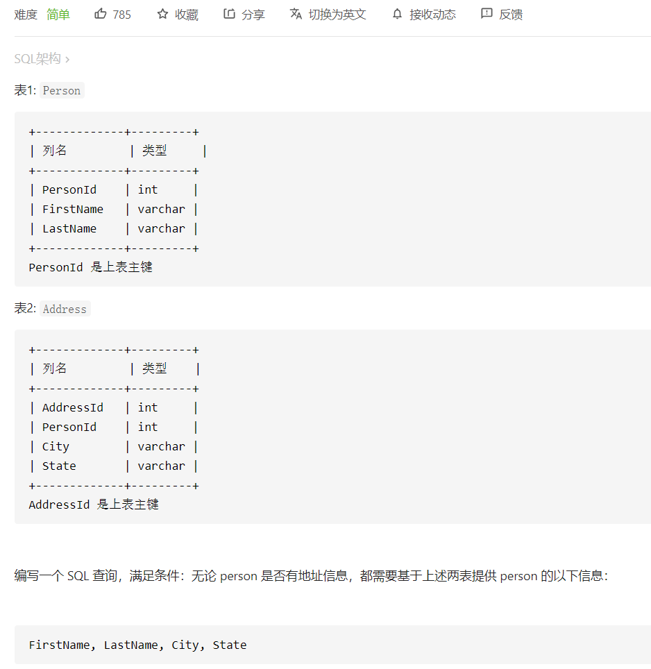

# 175. 组合两个表



 ```sql
 # Write your MySQL query statement below
 select Person.FirstName,Person.LastName,Address.City,Address.State
 from Person left join Address
 on Person.PersonId = Address.PersonId;
 ```


