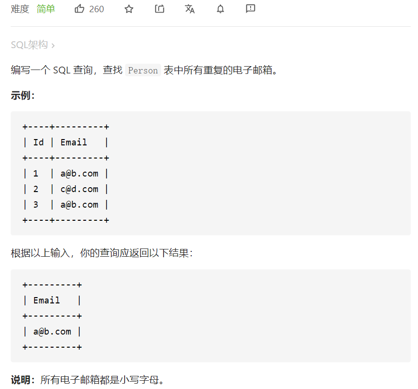

# 182. 查找重复的电子邮箱

[https://leetcode-cn.com/problems/duplicate-emails/](https://leetcode-cn.com/problems/duplicate-emails/)



# group by | having

 ```sql
 # Write your MySQL query statement below
 select Email
 from Person
 group by Email
 having count(id)>1;
 ```


# Write your MySQL query statement below

select Email

from Person

group by Email

having count(id)>1;

