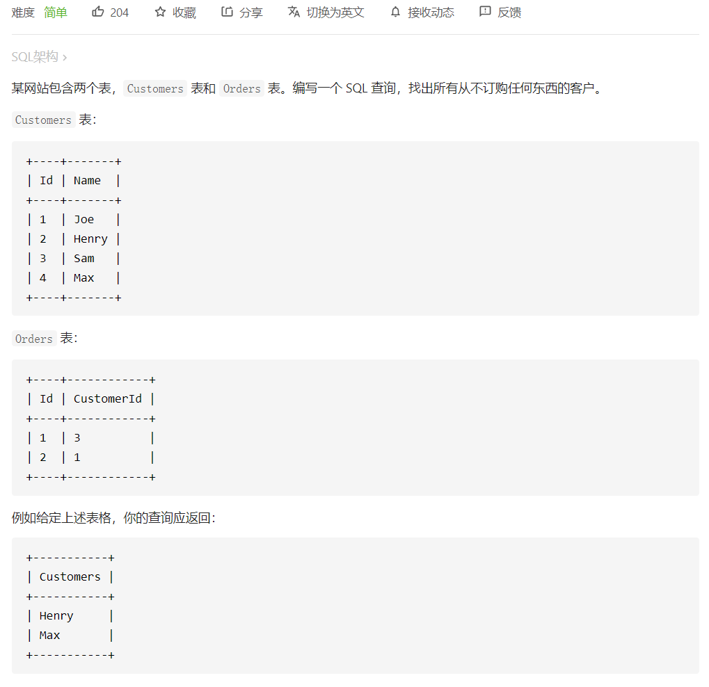

# 183. 从不订购的客户



# 外连接

 ```sql
 # Write your MySQL query statement below
 select c.Name Customers from 
 Customers c  left join Orders o
 on c.Id = o.CustomerId
 where o.Id is null;
 ```


- 将左连接到Orders表，增加了O.Id字段。根据on条件查询O.Id字段值，没有查询到则返回null

- 在where约束下进行select查询

# 子查询

 ```sql
 # Write your MySQL query statement below
 select c.Name as Customers
 from Customers as c
 where c.id not in
 (select distinct customerid from orders);
 
 ```


