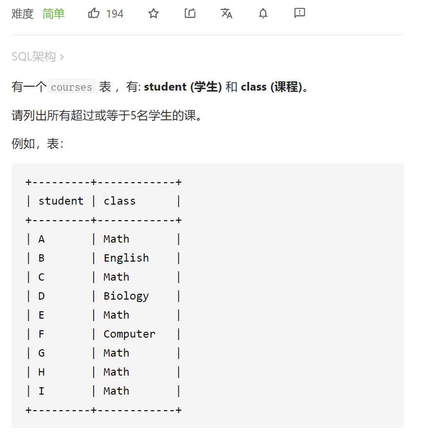

# 596. 超过5名学生的课

[https://leetcode-cn.com/problems/classes-more-than-5-students/submissions/](https://leetcode-cn.com/problems/classes-more-than-5-students/submissions/)



# having

 ```sql
 # Write your MySQL query statement below
 select class
 from courses
 group by class
 having count(distinct student)>=5;
 ```


# 子查询

 ```sql
 # Write your MySQL query statement below
 select class
 from (select class,count(distinct student) as cnt from courses group by class) as temp
 where cnt>=5;
 
 ```


