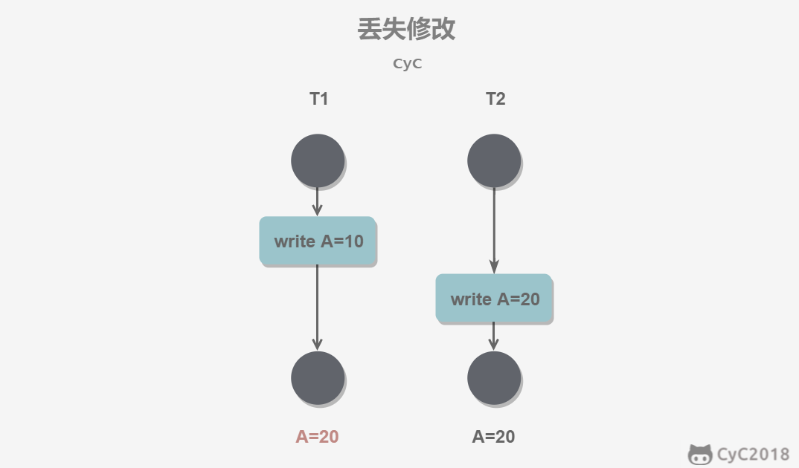
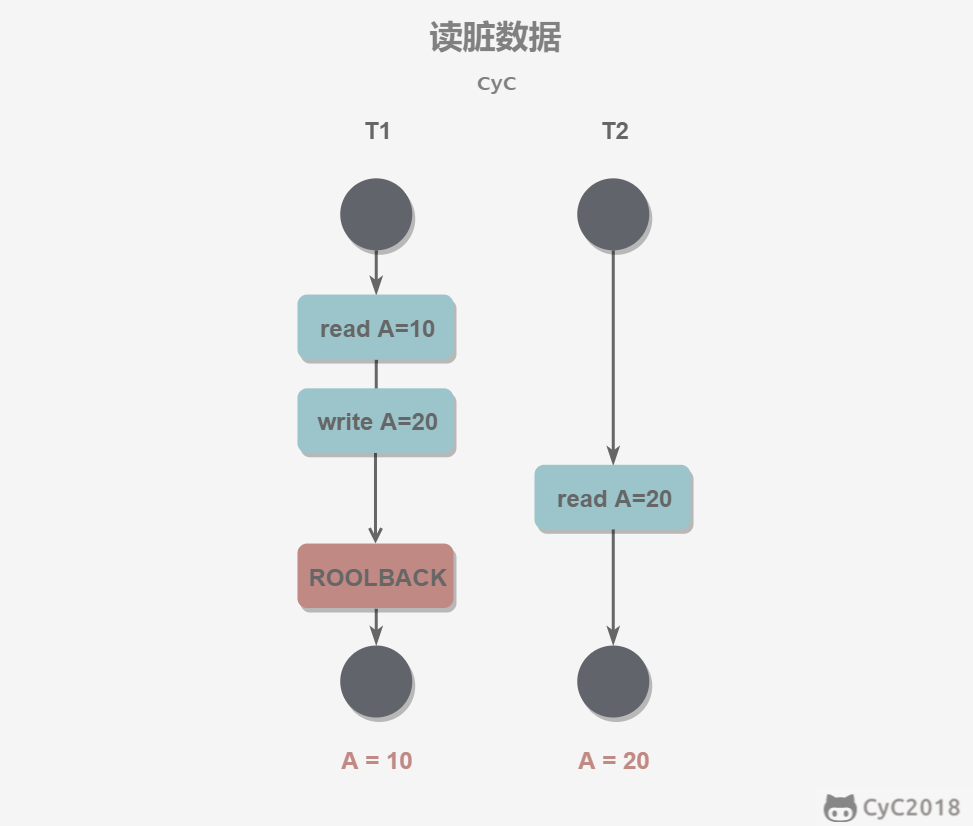
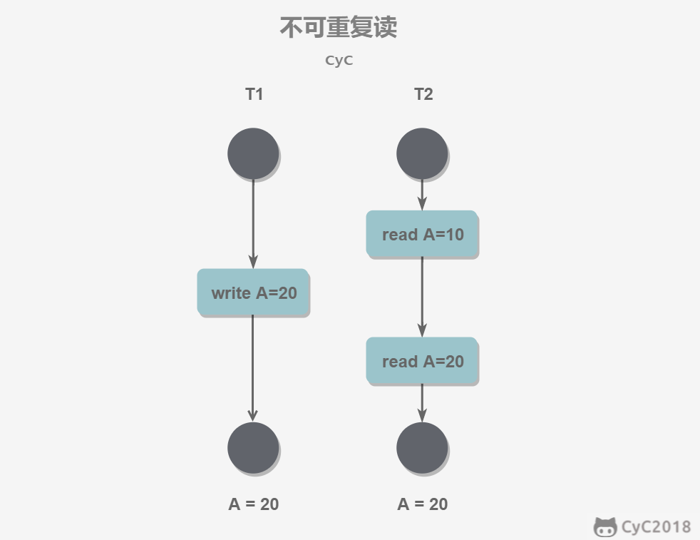
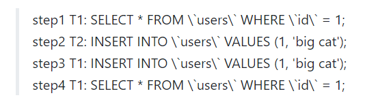
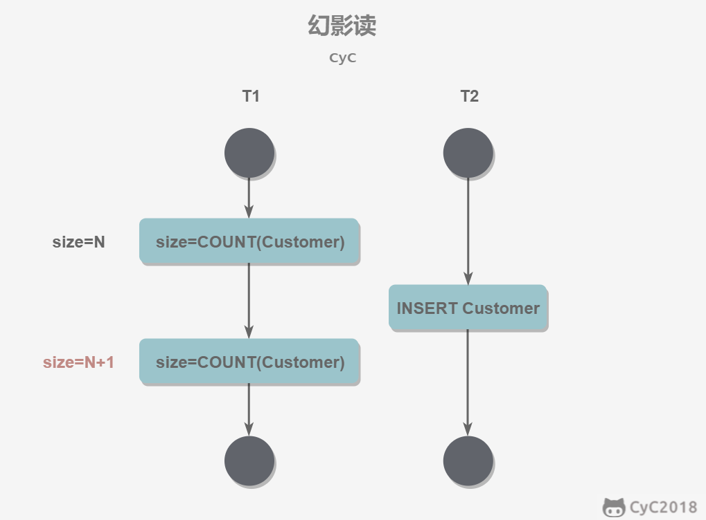

# 数据库系统原理

# [事务](https://github.com/CyC2018/CS-Notes/blob/master/notes/数据库系统原理.md#一事务)

## 四大特征（ACID）

1. 原子性：事务是不可分割的最小操作单位，要么同时成功，要么同时失败。

2. 一致性：数据库在事务执行前后都保持一致性状态。在一致性状态下，所有事务对同一个数据的读取结果都是相同的。

3. 隔离性：多个事务之间。相互独立。一个事务所做的修改在最终提交以前，对其它事务是不可见的。

4. 持久性：当事务提交或回滚后，数据库会持久化的保存数据。即使系统发生崩溃，事务执行的结果也不能丢失。

## 并发一致性问题

- 丢失修改

-   丢失修改指一个事务的更新操作被另外一个事务的更新操作替换。一般在现实生活中常会遇到，例如：T1 和 T2 两个事务都对一个数据进行修改，T1 先修改并提交生效，T2 随后修改，T2 的修改覆盖了 T1 的修改了。

- 读脏数据（脏读）

-   一个事务，读取到另一个事务中没有提交的数据

-   读脏数据指在不同的事务下，当前事务可以读到另外事务未提交的数据。例如：T1 修改一个数据但未提交，T2 随后读取这个数据。如果 T1 撤销了这次修改，那么 T2 读取的数据是脏数据。

- 不可重复读

-   在同一个事务中，两次读取到的数据不一样。

-   不可重复读指在一个事务内多次读取同一数据集合。在这一事务还未结束前，另一事务也访问了该同一数据集合并做了修改，由于第二个事务的修改，第一次事务的两次读取的数据可能不一致。例如：T2 读取一个数据，T1 对该数据做了修改。如果 T2 再次读取这个数据，此时读取的结果和第一次读取的结果不同。

- 幻读

-   一个事务操作(DML)数据表中所有记录，另一个事务添加了一条数据，则第一个事务查询不到自己的修改。

-   幻读，并不是说两次读取获取的结果集不同，幻读侧重的方面是某一次的 select 操作得到的结果所表征的数据状态无法支撑后续的业务操作。更为具体一些：select 某记录是否存在，不存在，准备插入此记录，但执行 insert 时发现此记录已存在，无法插入，此时就发生了幻读。

在 RR 隔离级别下，step1、step2 是会正常执行的，step3 则会报错主键冲突，对于 T1 的业务来说是执行失败的，这里 T1 就是发生了幻读，因为 T1 在 step1 中读取的数据状态并不能支撑后续的业务操作，T1：“见鬼了，我刚才读到的结果应该可以支持我这样操作才对啊，为什么现在不可以”。T1 不敢相信的又执行了 step4，发现和 setp1 读取的结果是一样的（RR下的 MMVC机制）。此时，幻读无疑已经发生，T1 无论读取多少次，都查不到 id = 1 的记录，但它的确无法插入这条他通过读取来认定不存在的记录（此数据已被T2插入），对于 T1 来说，它幻读了。

# 事物的隔离级别

## 未提交读

事务中的修改，即使没有提交，对其它事务也是可见的。

## 提交读

一个事务只能读取已经提交的事务所做的修改。换句话说，一个事务所做的修改在提交之前对其它事务是不可见的。

## 可重复读

保证在同一个事务中多次读取同一数据的结果是一样的。

## 可串行化

相当于多线程中的同步锁，同一时间数据只能被一个事务访问操作，只有该事务commit或rollback后，其他事务才可访问数据

# 多版本并发控制（MVCC）

多版本并发控制（Multi-Version Concurrency Control, MVCC）是 MySQL 的 InnoDB 存储引擎实现隔离级别的一种具体方式，用于实现提交读和可重复读这两种隔离级别。而未提交读隔离级别总是读取最新的数据行，要求很低，无需使用 MVCC。可串行化隔离级别需要对所有读取的行都加锁，单纯使用 MVCC 无法实现。

